# KANM-Show-Scheduling

### *Software Engineering CSCE 606 Team Project*

## Primary Links

- **Deployed App** - https://kanm-show-scheduler-b962465e9890.herokuapp.com/

- **Team Working Agreement** - https://github.com/amohanty03/KANM-Show-Scheduling/blob/main/documentation/Fall2024/Team_Working_Agreement.txt

- **Pivotal** - https://www.pivotaltracker.com/n/projects/2721031

- **Slack** - https://app.slack.com/client/T07NSND4DJ8/C07PD2K9U2U

- **GitHub** - https://github.com/amohanty03/KANM-Show-Scheduling

- **Code Climate Report** - https://codeclimate.com/github/amohanty03/KANM-Show-Scheduling


## Sections
- [Primary Links](#primary-links)
- [Team Members](#team-members)
- [Getting Started in Local](#getting-started-in-local)
- [Deploying on Heroku](#deploying-on-heroku)
- [Testing and Coverage](#testing-and-coverage)
- [Rubocop](#rubocop)


## Team Members

- Ali Nablan (aln170001@tamu.edu)
- Ankit Mohanty (amohanty03@tamu.edu)
- Davis Beilue (davis.beilue@tamu.edu)
- Haridher Pandiyan (haridher@tamu.edu)
- James Nojek (jnojek13@tamu.edu)
- Kriti Sarker (sarkriti@tamu.edu)
- Neeraj Julian Joseph Rajkumar (njulian@tamu.edu)
- Toan Vu (toanvpk@tamu.edu)

For any questions or troubleshooting queries, please send a mail to any of the above emails.


## Getting Started in Local
### 1. Clone the project and install dependencies
1. Clone the repository to your local machine.
2. Run `bundle config set --local without 'production' && bundle install`.
3. Run `bundle install` to install Gem dependencies.

*Note*: If running into issues when bundle can't install a specific dependency, it is suggested to install the package with sudo before running `bundle install` again.
For example: `sudo apt install postgresql`

*Note*: It is possible that `bundle install` will not work before setting up the Authentication Service in step 2, this is because the OmniAuth gems need the service configuration.

### 2. Setup Google Authentication Service
### A. Create a New Project in Google Developer Console
1. Go to the [Google Developer Console](https://console.developers.google.com/) after logging into Google with your `@tamu.edu` email.
2. Select or create a project for your application, choose `TAMU.EDU` under `Select a resource`.

### B. Set Up OAuth Consent Screen
1. In your project, go to `OAuth consent screen` under `APIs & Services`  
2. Set the user type to `Internal` for only` @tamu.edu` accounts or `External` for any other Gmail account, and click on `CREATE`.
3. Fill out the required information on the consent screen. You need to provide the app name, user support email, and developer contact information. Click on `SAVE AND CONTINUE`.
4. Add `userinfo.email` and `userinfo.profile` under Scopes.

### C. Set Up Credentials
1. In your project, go to `Credentials` under `APIs & Services`.
2. Select `OAuth Client ID` and choose `Web Application` as the application type and give your application a name.
3. Under `Authorized Redirect URIs`, add the following for local setup
    - `http://localhost:3000/auth/google_oauth2/callback`
    - `http://127.0.0.1:3000/auth/google_oauth2/callback`

*Note*: If you deploy your application to hosting service, you will need to add the URL to your application followed by `auth/google_oauth2/callback`.
1. Click `Create`. You will receive a client ID and client secret. Save this information to a safe place as it will be used to setup your local application in the next step

*Note*: In the future, if it is desired for other authentication service, the instruction can be found in [this project](https://github.com/tamu-edu-students/Google-Auth-Ruby-By-JD).

### 3. Add OAuth ID and Secret to Rails Credentials
1. Open a terminal in the root of your cloned project
2. Run `EDITOR=nano rails credentials:edit` and add the following to the end of the file
```yaml
   google:
     client_id: your_client_id_from_previous_step
     client_secret: your_client_secret_from_previous_step
```
3. A `master.key` and `credentials.yml.enc` will be generated. If it fails saying "cannot decrypt", then delete the old file. If you could not finish "bundle install" in step 1, this is the good time to run it again and install all required dependencies

### 4. Adding db:seed for user authentication
The db is initially seeded with this project developers as admins, to add yourself, go to `db/seeds.rb` and add the following with your information:
```yaml
    { email: 'your_tamu_email_is_required',
      uin: 'optional',
      first_name: 'optional',
      last_name: 'optional',
      role: 1 }
```
Note: Your TAMU email is a required field. `role: 1` is super admin which can add, edit, and delete admins. `role: 2` refers to a regular admin without the mentioned privileges.

### 5. Complete database and start the application
1. Run `rails db:migrate`.
2. Run `rails db:seed`.
3. Run `rails server`.


## Deploying on Heroku
### 1. Setting up the App
- Go to the **Heroku** website and create a new app (say kanm-pv).
- Open this app. Go to **Resources** and click **Find more add-ons**. Here select **Heroku Postgres** and then the *"Essential0" (0.007$/hr)* plan. Submit this order.

### 2. Deploying the App
- From your terminal, login to Heroku via: `heroku login`.
- Now we will create a new Heroku remote, so that we can push the current codebase to it. Please run:
   `heroku git:remote -a <your-new-app-name> -r <heroku-new-remote-name>`
   (Example: `heroku git:remote -a kanm-pv -r heroku-pv`). 
   The `-r` flag lets you rename the remote, so pick a unique name so that it doesn't clash with any existing deployments you may have.
- Run: `git remote` to verify that its been added.
- So before pushing to Heroku, we need to add and commit our updated `credentials.yml.enc` file. So please run:
  ```
    git add .`
    git commit -m "updated credentials"
  ```
- Next run: `git push <your-heroku-remote-name> main` (Example `git push heroku-pv main`). This should succeed.
- Next run the following 3 commands:
  ```
    heroku config:set RAILS_MASTER_KEY=`cat config/master.key`
    heroku run rails db:migrate`
    heroku run rails db:seed
  ```
- Next go to your Heroku app page, go to `Settings` and click `Reveal Config Vars`. You should be seeing **8** of them.
- Now on your Heroku app page, click the button `Open App` to view the deployed application. You should successfully see the required home page of our application. Don't login just yet.


### 3. GCP Change
- Note the domain of the deployed app.
- Before you try logging in, you need to add the **callback** to Google Auth as mentioned in 2. Setup Google Authentication Service -> C. Set Up Credentials. The URL for this will be based on the above URL you got from the previous step, but substitute the `/login/index` with `/auth/google_oauth2/callback` (Example: https://kanm-pv-bdd730616f63.herokuapp.com/auth/google_oauth/callback`). 
- Once added, you are good to go. Try logging in again and you should hopefully succeed.
- You should be able to view the "welcome" and "calendar" pages. Check out the next section for how to get access to the "admin" pages.

## Application Walkthrough
### 1. Welcome Page
- This is the Welcome Page of the KANM Radio Show Scheduler. When you visit for the first or when you log out, you will land on this page.
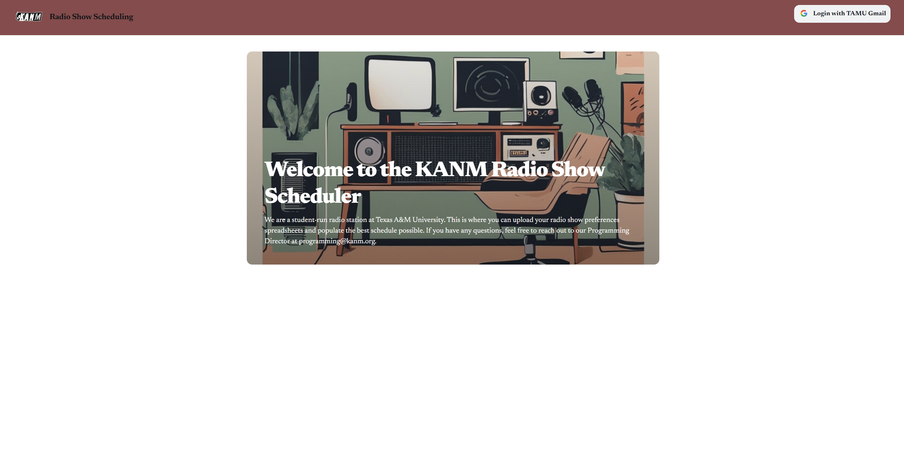
### 2. Login Page
- Clicking the `Login with TAMU Gmail` button located in the top-right of the Welcome Page will take you to Google's sign-in page as shown below.
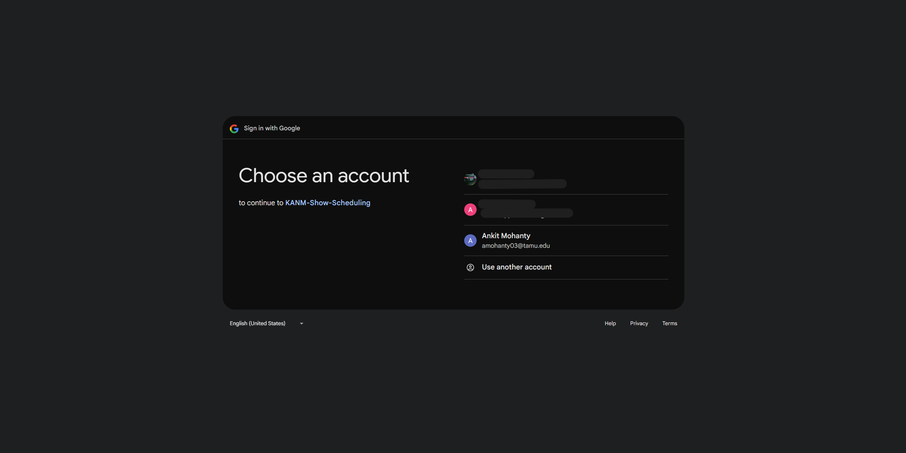
### 3. Upload Page
- After logging in, you will be redirected to the Upload Page where you get the following options:
    - Option 1: Generate Schedule
        - After uploading an .xlsx spreadsheet, click on `Generate Schedule` to display the schedule based on RJ preferences.
    - Option 2: Delete Selected Files
        - Uploaded a file by mistake? No worries, select the file you want to delete, click on `Delete Selected Files` and then it's gone!
    - Option 3: Download Selected Files
        - If you're unsure of the data that has already been uploaded, you can download the selected set of files.
    - Option 4: Upload
        - This is the starting step for schedule generation. Upload the spreadsheet generated from the RJ Preferences Google Form. You are only allowed to upload Excel files. You're not allowed to:
            - Upload a file containing a file name longer than 60 characters.
            - Upload a file containing the same name as one of the previously uploaded files.
        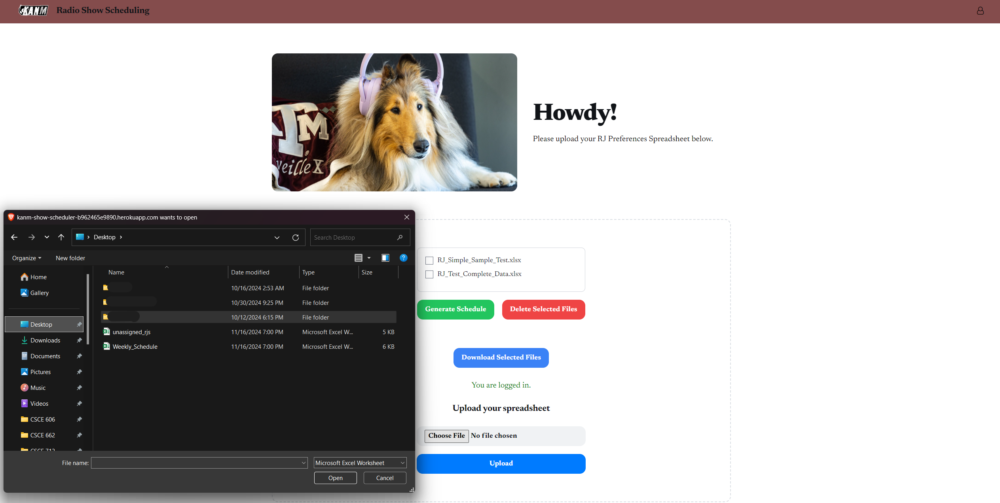
### 4. Generate Schedule
- After a successful upload of the spreadsheet and clicking on `Generate Schedule` will generate a tabular view of the Scheduled Shows.
- Now, you have the following options:
    - You can see the tabular view of scheduled shows of each day of the week. You can switch days using the dropdown.
        <p align="center">
            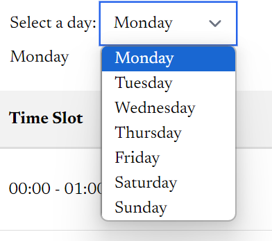
        </p>
    - Export the weekly schedule as an Excel File by clicking on `Export Schedule`. Refer below for example output.

        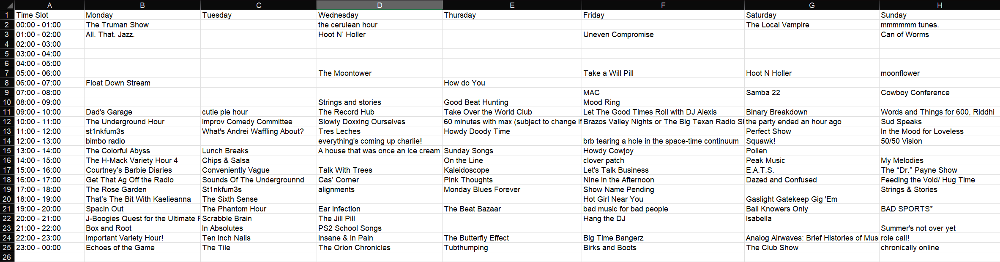
    - There may be RJs who were not assigned due to unresolvable conflicts and must be resolved manually. You can export this list by clicking on `Download Unassigned RJ List`.

        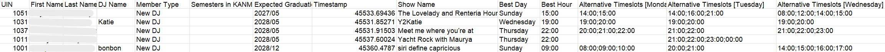
### 5. Profile Section
- After you've logged in, the top-right section of the page consists of the `Logout` and `Manage Admins`* options under the Profile outline.

    **Note*: If you're a regular admin (role: 2), you will *NOT* see the `Manage Admins` option.
    <p align="center">
        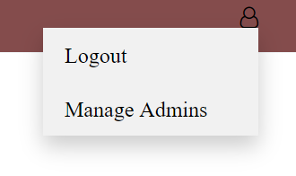
    </p>
### 6. Manage Admins
- If you're a super admin (role: 1) and click on the `Manage Admins`, you'll be redirected to the Admins page as shown below.
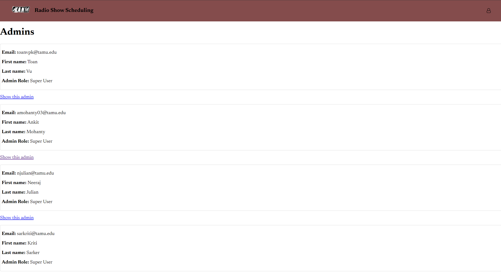
- Click on `Show this admin`, you'll get more information on the admin:
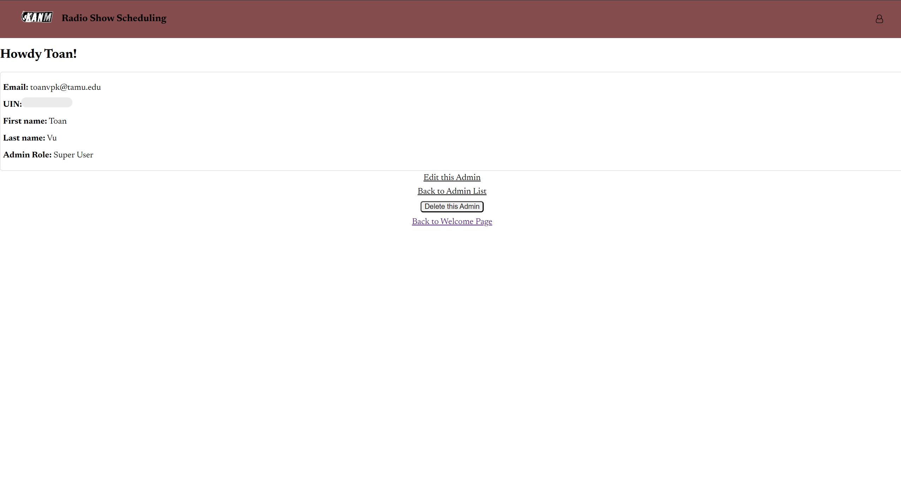
- You can also `Edit this Admin`, `Delete this Admin` and add a `New admin`.
    - For `Edit this Admin`, you have: 
    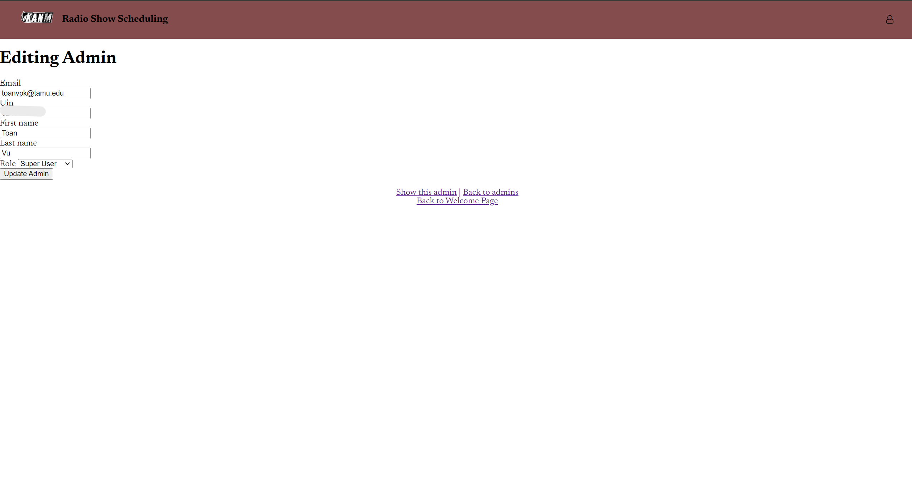
    - For `New admin`, you can find this option at the bottom of the Admins page and you have: 
    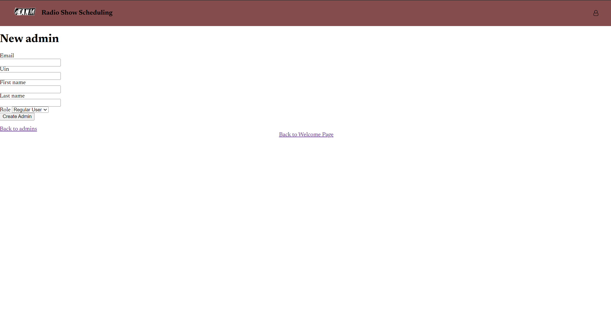
## Testing and Coverage

- Run `bundle exec cucumber`. All BDD testcases should pass.
- Run `bundle exec rspec`. All TDD testcases should pass.
View the coverage report summary at `coverage/.last_run.json`.
View the detailed coverage report at `coverage/index.html` .

## Rubocop

Please run ` rubocop --format simple --out reports/rubocop_summary.txt `.
View the report at `reports/rubocop_summary.txt`.


**Ruby version : 3.3.4**
